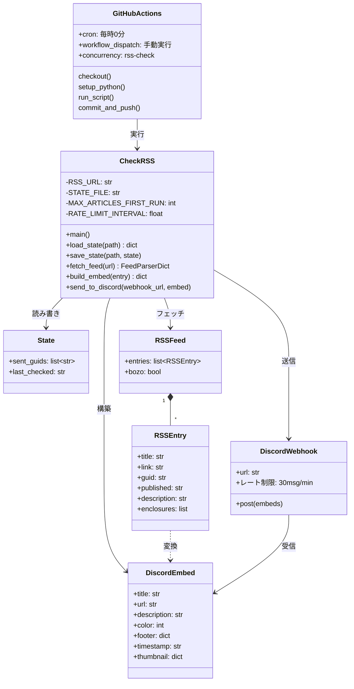
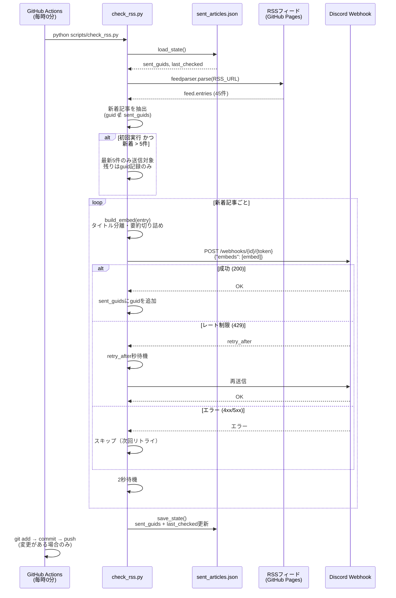

# RSS to Discord 通知

テスト・QA関連ブログの[RSSフィード](https://yoshikiito.github.io/test-qa-rss-feed/)を1時間ごとにチェックし、新着記事をDiscordに通知します。

## セットアップ

### 1. Discord Webhookの作成

1. Discordで通知先チャンネルの設定（歯車アイコン）を開く
2. **連携サービス** → **ウェブフック** → **新しいウェブフック** をクリック
3. 名前を設定（例: `RSS通知Bot`）
4. **ウェブフックURLをコピー** をクリック

### 2. GitHubリポジトリの設定

1. このリポジトリをGitHubにプッシュ
2. **Settings** → **Secrets and variables** → **Actions** を開く
3. **New repository secret** をクリック
4. Name: `DISCORD_WEBHOOK_URL`、Secret: コピーしたWebhook URL を入力

### 3. 動作確認

**Actions** → **Check RSS Feed** → **Run workflow** で手動実行し、Discordに通知が届くことを確認してください。

## 仕組み

- GitHub Actionsが毎時0分にRSSフィードをチェック
- 送信済み記事のIDを `data/sent_articles.json` で管理し、重複送信を防止
- 新着記事はDiscord Embed形式で送信（タイトル・リンク・要約・サムネイル付き）
- 初回実行時は最新5件のみ送信（チャンネルが埋まるのを防止）

## 設計図

### クラス図



### シーケンス図



## ローカルテスト

```bash
pip install -r requirements.txt
DISCORD_WEBHOOK_URL="https://discord.com/api/webhooks/..." python scripts/check_rss.py
```
