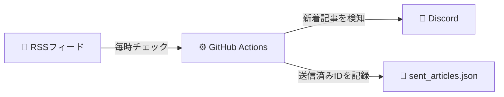
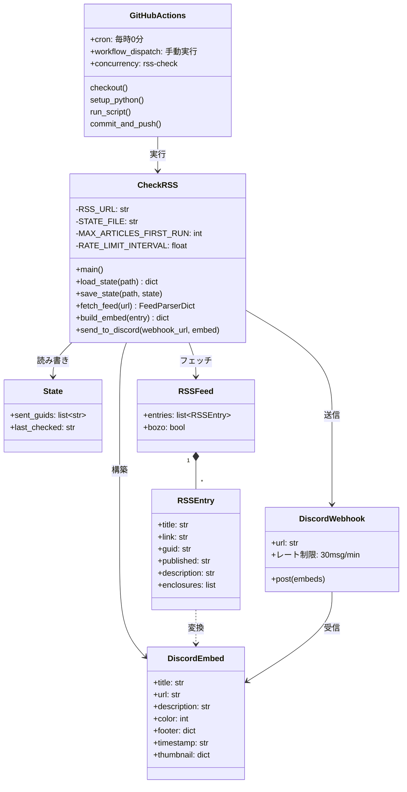
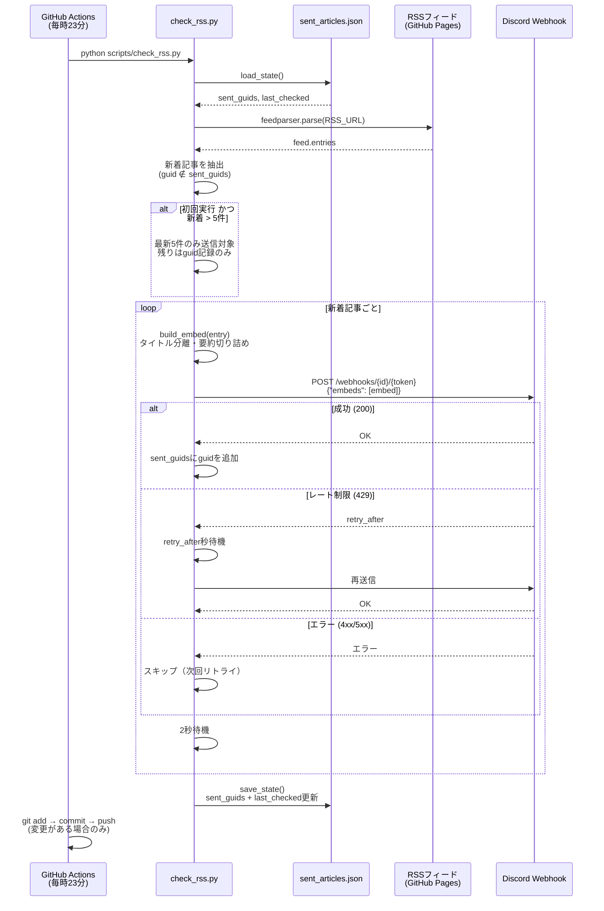

# RSS to Discord 通知

テスト・QA関連ブログの[RSSフィード](https://yoshikiito.github.io/test-qa-rss-feed/)を毎時23分にチェックし、新着記事をDiscordに通知します。


```mermaid
flowchart LR
    RSS[📡 RSSフィード] -->|毎時チェック| Actions[⚙️ GitHub Actions]
    Actions -->|新着記事を検知| Discord[💬 Discord]
    Actions -->|送信済みIDを記録| State[📄 sent_articles.json]
```

## 前提条件

- GitHubアカウント
- Discordサーバーの管理権限（Webhook作成に必要）

## セットアップ

### 1. Discord Webhookの作成

1. Discordで通知先チャンネルの設定（歯車アイコン）を開く
2. **連携サービス** → **ウェブフック** → **新しいウェブフック** をクリック
3. 名前を設定（例: `RSS通知Bot`）
4. **ウェブフックURLをコピー** をクリック

### 2. GitHubリポジトリの設定

1. このリポジトリをForkまたはクローンしてGitHubにプッシュ
2. **Settings** → **Secrets and variables** → **Actions** を開く
3. **New repository secret** をクリック
4. Name: `DISCORD_WEBHOOK_URL`、Secret: コピーしたWebhook URL を入力

### 3. 動作確認

**Actions** → **Check RSS Feed** → **Run workflow** で手動実行し、Discordに通知が届くことを確認してください。

## 仕組み

| ステップ | 処理内容 |
|---|---|
| 1. トリガー | GitHub Actionsが毎時23分に起動（手動実行も可） |
| 2. 状態読み込み | `data/sent_articles.json` から送信済み記事IDを取得 |
| 3. RSS取得 | フィードをパースし、未送信の記事を抽出 |
| 4. Discord送信 | Embed形式で送信（タイトル・リンク・要約・サムネイル付き） |
| 5. 状態保存 | 送信済みIDをJSONに記録し、自動コミット・プッシュ |

- 初回実行時は最新5件のみ送信（チャンネルが埋まるのを防止）
- 送信失敗した記事は次回実行時に自動リトライ

## カスタマイズ

`scripts/check_rss.py` の定数を編集してください。

| 定数 | デフォルト | 説明 |
|---|---|---|
| `RSS_URL` | テスト・QAフィード | 監視するRSSフィードのURL |
| `MAX_ARTICLES_FIRST_RUN` | `5` | 初回実行時の最大送信数 |
| `RATE_LIMIT_INTERVAL` | `2.0` | 送信間隔（秒） |
| `DESCRIPTION_MAX_LENGTH` | `300` | 要約の最大文字数 |

チェック頻度を変更する場合は `.github/workflows/check-rss.yml` の cron 式を編集してください。

```yaml
# 例: 6時間ごと
- cron: '0 */6 * * *'
```

## ローカル開発と依存管理

Python 3.12 と [uv 0.12.19](https://docs.astral.sh/uv/getting-started/installation/) を使います。
依存の宣言は `pyproject.toml`、解決済みバージョンと配布物のハッシュは `uv.lock` で管理します。
旧 `requirements.txt` の直接依存を `pyproject.toml` に移し、Requestsは別のセキュリティ更新として2.33.0に更新しています。

```bash
uv sync --locked --no-dev
uv run --locked --no-dev python -m unittest discover -s tests -v
```

ユニットテストは外部通信をブロックし、RSS取得・Discord送信をモックに置き換えます。
実際のWebhook URLやトークンは不要です。CIのテストジョブにもSecretsを渡しません。

実運用の通知をローカルで実行する場合のみ、事前に `DISCORD_WEBHOOK_URL` を設定して実行します。
このコマンドはDiscordへ送信し、状態ファイルも更新します。

```bash
uv run --locked --no-dev python scripts/check_rss.py
```

依存を意図的に変更するときは `pyproject.toml` を変更して `uv lock` を実行し、
両ファイルの差分とユニットテストを確認してください。通常のCI・通知処理では `--locked` により
宣言とlockの不一致をエラーにし、暗黙の更新を防ぎます。
PyPIとuv既定の `first-index` 方針を使い、追加indexや認証情報は設定しません。

uvへの移行だけでは脆弱な依存や悪意あるパッケージは安全になりません。
Requestsは2.33.0へ更新し、CVE-2024-47081とCVE-2026-25645の対象範囲を外しています。
依存・実行環境の継続的な確認は引き続き必要です。
詳細は [Requestsの公式セキュリティ情報](https://github.com/psf/requests/security/advisories) を参照してください。

## トラブルシューティング

| 症状 | 原因と対処 |
|---|---|
| 通知が来ない | Actionsタブでワークフローの実行履歴を確認。赤い×ならログを見る |
| `DISCORD_WEBHOOK_URL環境変数が設定されていません` | GitHub Secretsの設定を確認（名前が正確に `DISCORD_WEBHOOK_URL` か） |
| 同じ記事が何度も届く | `data/sent_articles.json` が壊れている可能性。ファイルを確認し、不正なJSONなら `{"sent_guids": [], "last_checked": null}` にリセット |
| Actionsが実行されない | リポジトリの **Settings** → **Actions** → **General** で Actions が有効か確認 |

## 設計図

<details>
<summary>クラス図（クリックで展開）</summary>


```mermaid
classDiagram
    class GitHubActions {
        +cron: 毎時0分
        +workflow_dispatch: 手動実行
        +concurrency: rss-check
        checkout()
        setup_python()
        run_script()
        commit_and_push()
    }

    class CheckRSS {
        -RSS_URL: str
        -STATE_FILE: str
        -MAX_ARTICLES_FIRST_RUN: int
        -RATE_LIMIT_INTERVAL: float
        +main()
        +load_state(path) dict
        +save_state(path, state)
        +fetch_feed(url) FeedParserDict
        +build_embed(entry) dict
        +send_to_discord(webhook_url, embed)
    }

    class State {
        +sent_guids: list~str~
        +last_checked: str
    }

    class RSSEntry {
        +title: str
        +link: str
        +guid: str
        +published: str
        +description: str
        +enclosures: list
    }

    class DiscordEmbed {
        +title: str
        +url: str
        +description: str
        +color: int
        +footer: dict
        +timestamp: str
        +thumbnail: dict
    }

    class DiscordWebhook {
        +url: str
        +post(embeds)
        +レート制限: 30msg/min
    }

    class RSSFeed {
        +entries: list~RSSEntry~
        +bozo: bool
    }

    GitHubActions --> CheckRSS : 実行
    CheckRSS --> State : 読み書き
    CheckRSS --> RSSFeed : フェッチ
    RSSFeed "1" *-- "*" RSSEntry
    CheckRSS --> DiscordEmbed : 構築
    RSSEntry ..> DiscordEmbed : 変換
    CheckRSS --> DiscordWebhook : 送信
    DiscordWebhook --> DiscordEmbed : 受信
```

</details>

<details>
<summary>シーケンス図（クリックで展開）</summary>


```mermaid
sequenceDiagram
    participant Cron as GitHub Actions<br/>(毎時23分)
    participant Script as check_rss.py
    participant JSON as sent_articles.json
    participant RSS as RSSフィード<br/>(GitHub Pages)
    participant Discord as Discord Webhook

    Cron->>Script: python scripts/check_rss.py

    Script->>JSON: load_state()
    JSON-->>Script: sent_guids, last_checked

    Script->>RSS: feedparser.parse(RSS_URL)
    RSS-->>Script: feed.entries

    Script->>Script: 新着記事を抽出<br/>(guid ∉ sent_guids)

    alt 初回実行 かつ 新着 > 5件
        Script->>Script: 最新5件のみ送信対象<br/>残りはguid記録のみ
    end

    loop 新着記事ごと
        Script->>Script: build_embed(entry)<br/>タイトル分離・要約切り詰め
        Script->>Discord: POST /webhooks/{id}/{token}<br/>{"embeds": [embed]}
        alt 成功 (200)
            Discord-->>Script: OK
            Script->>Script: sent_guidsにguidを追加
        else レート制限 (429)
            Discord-->>Script: retry_after
            Script->>Script: retry_after秒待機
            Script->>Discord: 再送信
            Discord-->>Script: OK
        else エラー (4xx/5xx)
            Discord-->>Script: エラー
            Script->>Script: スキップ（次回リトライ）
        end
        Script->>Script: 2秒待機
    end

    Script->>JSON: save_state()<br/>sent_guids + last_checked更新

    Cron->>Cron: git add → commit → push<br/>(変更がある場合のみ)
```

</details>
